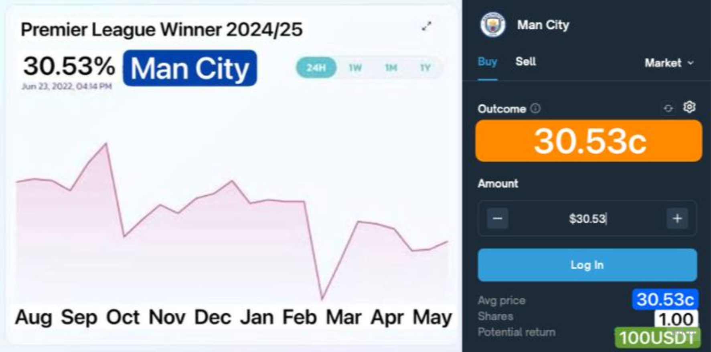

# Azuro Hackaton

Template for working example app:
https://github.com/Azuro-protocol/example-app

## Hackaton Docs
https://gem.azuro.org/community/hackathon
https://gem.azuro.org/hub/apps/guides/tutorial
https://gem.azuro.org/hub/apps/guides/advanced/overview
https://gem.azuro.org/hub/apps/guides/freebets/overview
https://gem.azuro.org/hub/apps/toolkit/overview
https://gem.azuro.org/hub/apps/sdk/overview
https://gem.azuro.org/hub/apps/APIs

## Project tech stack and structure
### Project Structure:
The project follows a typical Next.js structure with some custom organization:

1. `/src` directory contains the main application code
2. `/app` directory for Next.js 13+ app router
3. `/compositions` for complex components and page-specific layouts
4. `/components` for reusable UI components
5. `/hooks` for custom React hooks
6. `/contexts` for React context providers
7. `/helpers` for utility functions

### Tech Stack:
- Next.js 14.2.7
- React 18
- TypeScript
- Tailwind CSS for styling
- Wagmi for Ethereum interactions
- @azuro-org/sdk for Azuro Protocol integration
- @headlessui/react for accessible UI components

### Key Components:
1. PageLayout: Main layout component wrapping the entire application
2. Betslip: Manages user's betting selections
3. Navigation: Handles site-wide navigation
4. Markets: Displays available betting markets
5. Game: Represents individual game/event information

### State Management:
- Uses a combination of React hooks and context for state management
- Utilizes @azuro-org/sdk hooks for fetching and managing betting data

## Azuro SDK
The Azuro SDK is written in TypeScript and is designed for React apps.
it provides a variety of hooks and utilities to simplify the development of betting dApps including handling betting logic, live updates, and user interactions.
The SDK uses React, TypeScript, GraphQL, and integrates with the Azuro Protocol's APIs and smart contracts.
It helps developers cerate fully customizable betting applications without worriying about comples backend setups.

## Azuro toolkit
Written in Typescript. Includes utilities, constants, and Apollo GraphQL support for interacting with Azuro's contracts.
The tech stack involves npm packages such as @apolloc/client, @axuo-org/dictionaries, viem and @wagmi/core
The toolkit provides helpers like setup functions, odds calculation, live betting support, and itegration for Debridge corss-chain betting.
It also supports querying contract data through ABIs and GraphQL fragments.

## Project Requirements
1. Clone the repository containing the main UI template and familiarize yourself with the tech stack (Next.jz, Wagmi, etc.) and project structure.
https://github.com/Azuro-protocol/example-app

2. Create design mockups for the new UI.
Create a new UI with an end-user persona in mind. Who is your potential user? Is he/she a degen who's unfamiliar with prediction markets and wants to earn fast by betting on the best odds? Then organize the data to display the top events with best odds on your home screen. Is your user a sports betting pro? Then organize the data to display events as a series of championship brackets for separate sports events, etc.
‍
Feel free to add new elements, such as a placeholder for promotional banners - you can get inspiration in apps built on Azuro, find examples in Materials section.

3. Add the required feature Please implement the historical price chart in addition to your own ideas.
A historical price chart should reflect the market dynamics for prediction markets (see description and example in Azuro Materials below)

Bonus feature: Historical price chart that reflects market dynamics
Fetch historical odds / prices for each pre-match event and display their dynamic change over time in the form of an interactive diagram.
Transform Azuro’s AMM data into a historical line chart format
The chart’s x-axis to denote the time period, while the y-axis denotes odds (in form of percentages). Users should be able to select shorter/longer time periods — the chart will zoom in/out (i.e., zooming in to view daily odds and zooming out to view monthly odds).
Chart should display the exact percentage odds and timestamp when hovering on a specific point

Example:

4. Apply the new design styles and Ensure the new UI is bug-free and functional on the Polygon mainnet.
Make sure you've followed the structure of the example project very closely.
Your template should use the same tech stack and project structure as the Example project we provided.
Make sure your code is readable and can be easily used later for integration as a template.

5. Push your code to a public GitHub repository.
Add a readme where you specify motivations for your design choices.
Describing the idea behind your design choices will help us better evaluate your project.
For example, which user persona you are trying to target with your design, what use case are you trying to solve, etc.

## Evaluation Criteria
Functionality:
correct implementation of Azuro prediction markets functionality. All Azuro features should function as intended (betting, odds display, etc.). Historical price chart should also be implemented.

Project compatibility:
the project should use the same tech stack and follow closely the structure of the main template created by Azuro. The code should be readable and easily used by third-party apps as a template.

motivated design choices:
make sure your creative choices are motivated by the potential user persona or use case you're trying to solve with your design (see task #2 above). Describe your idea in the readme file for us to better evaluate your design.

## User persona
- Name: Matias
- Age: 30
- Gender: Male
- Occupation: Bartender
- Location: Buenos Aires, Argentina
- Interests: Gambling, Politics, Sports, e-sports, Crypto, Stablecoins
- Technical proficiency: Medium-Advanced
- Betting habits and preferences: Matias is a casual bettor who likes to bet on sports events and e-sports during weekends which makes the whole experience of watching the games live more fun for him. He also wants to bet on the outcome of football (soccer) leagues and elections.
- Any specific needs or pain points related to betting platforms: Traditional betting platforms in Latam are difficult to use and local currencies are not supported. Stablecoins bring great opportunities for latam users as they tend to travel a lot and traditional banking is not always available. Latam users are also big sports fans, especially football (soccer), and e-sports. They are also interested in global politics.

## Design specifics for our target user
- Modify branding to use our own colors, logo and name.
- Modify the Navigation to show only the Sports we support.
- Add a placeholder for promotional banners.
- A component for viewing Live events. // hecho
- A component for viewing Upcoming events.
- Historical price chart for prediction markets (Politics and Soccer Leagues winners).
- A slider component for Promotions and Free bets.
- Easy buy USDT (+ POL for gas) using credit card, Paypal, Apple Pay, Google Pay, and other payment methods.
- Easy bridge & swap from any chain to our supported chains using a 3rd party bridge.
- Filter by Countrys, Sports, Leagues, etc.
- Sports API for fetchin info about matches: resultados ultimos encuentros, posicion en la tabla, lesionades o bajas de cada equipo.
- Show the best outcomes to engage users looking for maximun return profit (also riskier bets)
- Show live wins: Show the best winners of the day or last days to show people how much you can win

## Faucets testnet
USDT Faucet
https://amoy.polygonscan.com/address/0x683026eb1b912795e4eb1e73da7e38c3f2f830c4

AZUSD Faucet:
https://amoy.polygonscan.com/address/0xf028b2dd00e20a8d9db3964a5feb0633d2ee46cd

Faucet POL Amoy:
https://faucet.polygon.technology/
